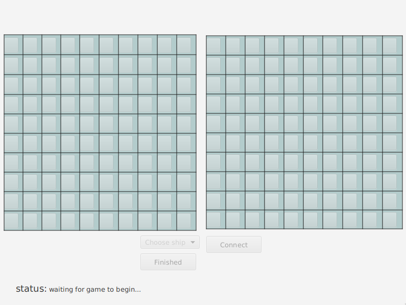
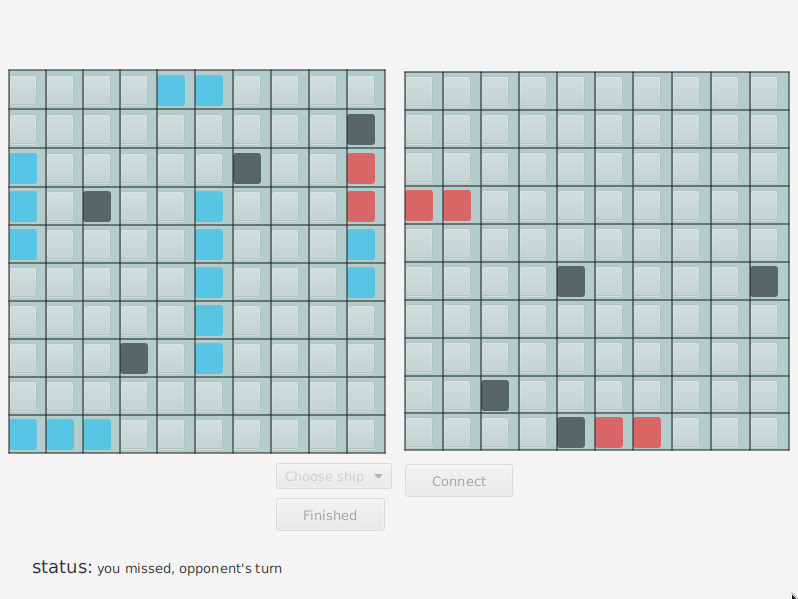

# Battleship

Java Client/Server Battleship GUI game with sockets.

--------------------

Install `java` and `javafx`.

Launch server:

```sh
cd bin
java server.Server
```

Launch client:

```sh
cd bin
export JAVAFX=/lib64/jvm/java-14-openjdk/lib/javafx
java --module-path $JAVAFX --add-modules javafx.controls,javafx.fxml gui.ClientGUI
```

Screenshots:



